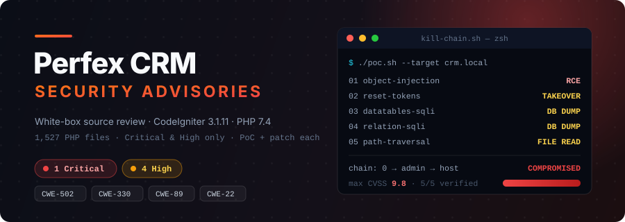

<p align="center">
  
</p>

# Perfex CRM — Security Advisories

Security research and vulnerability advisories for a Perfex-style CRM (**CodeIgniter 3.1.11 / PHP 7.4**).

**Researcher:** tal7aouy
**Date:** 2026-09-20
**Scope:** white-box source review (1,527 PHP files)
**Filter:** Critical & High severity only (issues that lead to code execution, account takeover, database compromise, or unauthenticated data theft)

---

## Advisories

| ID | Vulnerability | Auth | Impact | Severity |
|----|---------------|------|--------|----------|
| [VULN-01](01-object-injection-autologin/) | PHP Object Injection via `autologin` cookie | None | Pre-auth RCE | **Critical** |
| [VULN-02](02-predictable-reset-tokens/) | Predictable password-reset / set-password tokens | None | Admin account takeover | **High** |
| [VULN-03](03-sqli-datatables/) | SQL Injection in DataTables (`escape_str` unquoted) | Low-priv staff | Full DB dump | **High** |
| [VULN-04](04-sqli-get-relation-data/) | SQLi + missing authorization in `get_relation_data` | Any staff | Full DB dump | **High** |
| [VULN-05](05-path-traversal-download/) | Unauthenticated path traversal / file read | None | Arbitrary file disclosure | **High** |

## The kill chain

These are not isolated bugs — they chain into full compromise from zero access:

```
  VULN-01  ── unauth ──▶  Remote Code Execution                (game over on its own)
      │
      └─ if the PHP gadget is unavailable, fall back to:
              VULN-02  ── unauth ──▶  set a new admin password  ──▶  admin login
              VULN-03/04 ─ low priv ─▶ dump tblstaff hashes + API keys
              VULN-05  ── unauth ──▶  read files off the host
```

## Environment notes that increase exploitability

- `csrf_protection = false` (default) — every attack is a single request, no token needed.
- `global_xss_filtering = true` — does **not** protect against SQLi or any issue here.
- Cookies are neither encrypted nor signed by CodeIgniter 3 (root cause of VULN-01).

## Folder layout

Each advisory folder contains:

- `README.md` — full technical write-up (root cause, exploitation, impact, remediation)
- `poc.sh` — proof-of-concept driver script
- `patch.diff` — the fix

## Disclaimer

Published for defensive and educational purposes. Only test against systems you are authorized to assess.

— tal7aouy
